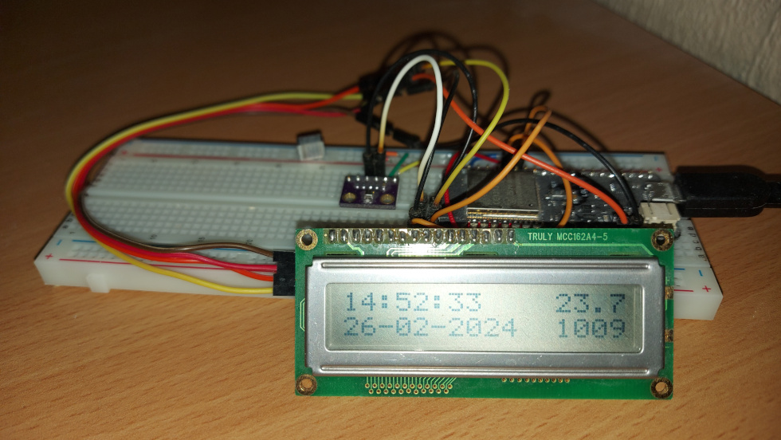

### Basic NTP Time/Date and BME280 Temperature/Humidity/Pressure Sensor
This is a simple Arduino project that gets the time from a NTP server, reads temperature, humidity and pressure from a BME280 sensor. Displays all data on a 16x2 LCD display, using an ESP32 board.

### Hardware
* ESP32 Wemos Lolin32 development board
* BME280 sensor
* LCD Display 16x2 with I2C interface
* Breadboard and jumper wires
* USB cable for programming and power

### Software
* Visual Code PlatformIO IDE
* BME280 sensor library
* LiquidCrystal_I2C library

### Circuit
* BME280 data pins connected to GPIO 21, 22 (I2C)
* LCD Display data pins connected to GPIO 21, 22 (I2C)

### Configuration
Update ssid and password in config.h with your WiFi credentials

### Operation
* The ESP32 connects to the configured WiFi network
* Get time from NTP server
* Temperature, humidity and pressure data is read from the BME280 sensor
* Display all data on the LCD display

### To Do
* Add error handling and recovery logic
* Enable OTA firmware updates

### References
* [Arduino](https://www.arduino.cc/)
* [Wokwi](https://wokwi.com/)
* [BME280 datasheet](https://www.bosch-sensortec.com/products/environmental-sensors/humidity-sensors-bme280/)
